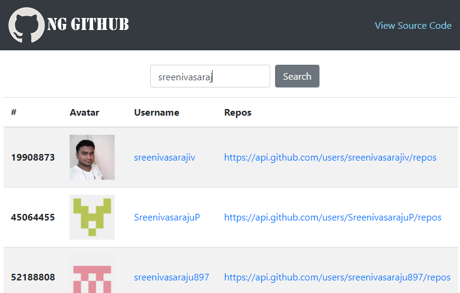
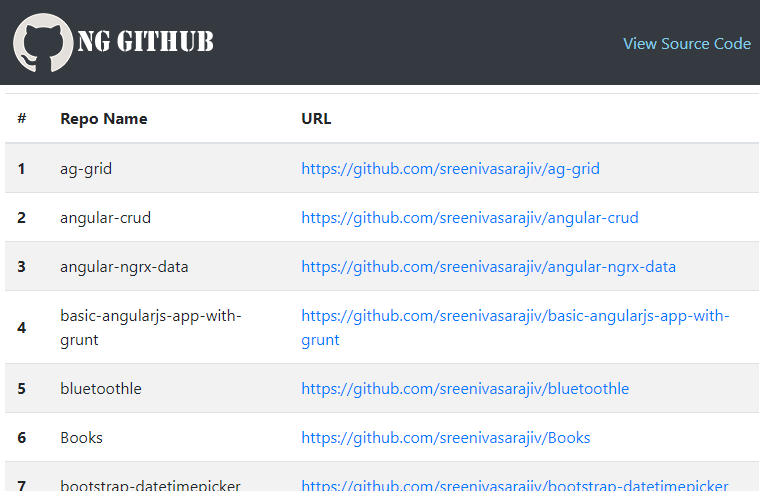
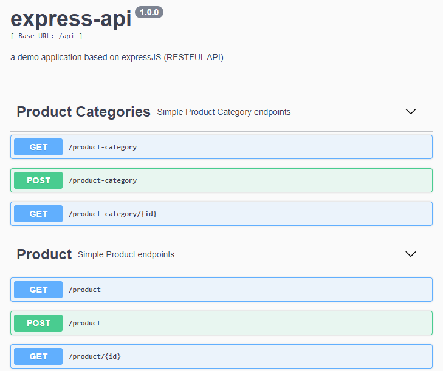
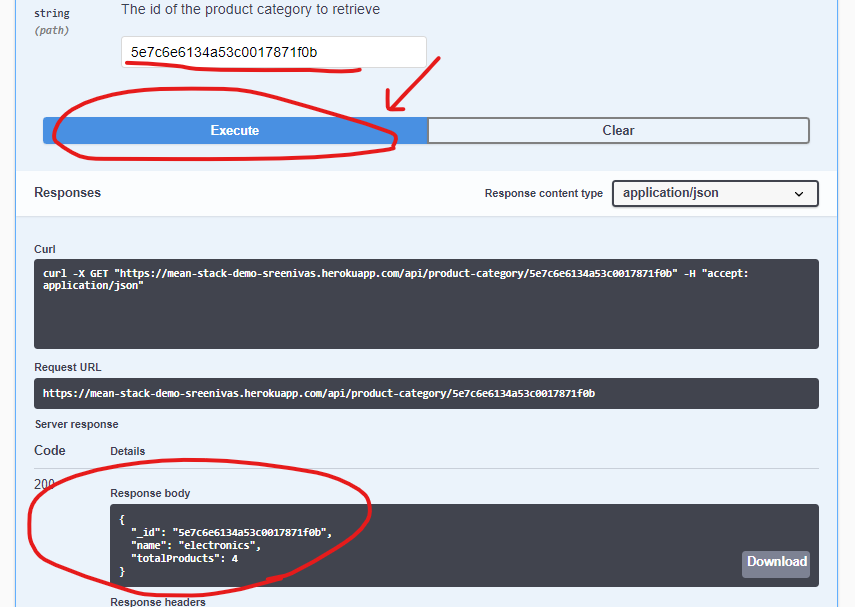

# MEAN Stack - Demo

### Synopsis

* This is a demo repo is to showcase my skills in __MEAN Stack Application Development__.
* This source contains two seperate applications,
1. __[ng-github](ng-github)__ - an __angular application__, used to search and list github users.
2. __[express-api](express-api)__ - an __expressJS__ based __RESTFUL API__ (using __MongoDB__ as database).

### Ng-Github
* A demo app is hosted at _**[https://sreenivasarajiv.github.io/mean-stack-demo/](https://sreenivasarajiv.github.io/mean-stack-demo/)**_
* Application uses __Angular 9 and Bootstrap__ Frameworks.
* You can search users by thier **github username** and can see thier **repositories.**
* To run application:

        cd ng-github
        npm install
        ng serve

### Express-API
* A demo app is hosted at _**[https://mean-stack-demo-sreenivas.herokuapp.com/api-docs](https://mean-stack-demo-sreenivas.herokuapp.com/api-docs)**_
* Application uses __ExpressJS, Mongoose, Winston packages.__
* Application has __global error handlers and global loggers.__
* Application also uses __Swagger Documentation as API Docs.__ **You can test the REST API in Swagger itself.**
* To run application:

        cd express-api
        yarn
        npm run start

* Application has two models,

        // product categtory
        {
            _id: string,
            name: string
        }

        // product
        {
            _id: string,
            name: string,
            price: integer,
            category: {
                _id: string,
                name: string
            }
        }

* Database has two master collections namingly,

        products
        productcategories

* *__totalProducts__* per **product-category** is calculated using **MongoDB's Aggregation Framework API** as follows, thus to reduce the number to database calls from server and send the load from server to database via optimized pipeline query.

        db.productcategories.aggregate([
            {
                '$match': {
                '_id': new ObjectId('5e7c393908755f2b341a6b3d')
                }
            }, {
                '$lookup': {
                'from': 'products', 
                'let': {
                    'categoryId': '$_id'
                }, 
                'pipeline': [
                    {
                    '$match': {
                        '$expr': {
                        '$eq': [
                            '$category._id', '$$categoryId'
                          ]
                        }
                      }
                    }
                ], 
                'as': 'products'
                }
            }, {
                '$project': {
                'name': 1, 
                'totalProducts': { '$size': '$products' }
               }
            }
        ]);

### Screenshots

___